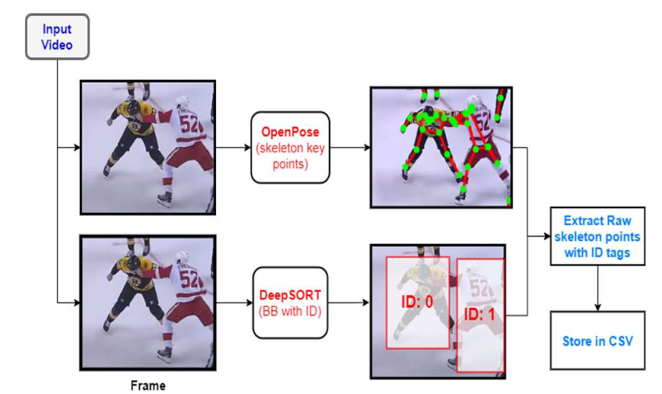
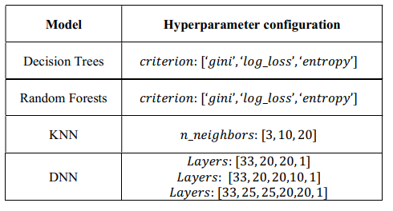

# Agitation detection system using OpenPose and DeepSORT

<p>Agitation is a common phenomenon in people
suffering from dementia which is characterized by harmful
behavior such as kicking, slapping, punching, hitting, and choking
etc. To mitigate these harmful behaviors, an agitation detection
system needs to be established. This paper, therefore, focuses on
the development of one such system. At first, key features are
engineered from the raw skeleton key points. The skeleton key
points are generated by passing the videos through OpenPose and
DeepSORT. OpenPose and DeepSORT work in parallel to
generate skeleton key points while also keeping track of individual
ID`s. These features include Euclidean norms, speeds, and
accelerations of the link lengths. PCA analysis reveals non-linear
separational boundaries in the feature space and therefore, nonlinear
supervised models such as Decision Trees, KNN, Random Forest classifier
and DNN are considered for training and testing. Further, a semi-supervised
spatiotemporal autoencoder is also trained and evaluated on raw videos rather than the engineered
features. KNN achieves an accuracy of 98.58 % on test set among
the supervised models, while the autoencoder achieves 93.7%.
Additionally, a web-based dashboard is also developed which has
the functionality to inform the concerned authority about the
location and time of the agitated event if detected. </p> 

## Extract Skeleton KeyPoints using OpenPose and DeepSORT
 </img>

## Design Rich Features from Skeleton KeyPoints
 </img>

## Apply PCA to eliminate Redundant Features
 </img>

## Apply Binary Classifiers using the 33 input features
 </img>

## Train the models
 </img>

## Results for 4 binary classifiers
 </img>


### See the step by step Code
```
main.ipynb
```

### Watch Demo

```
demo.mp4
```
